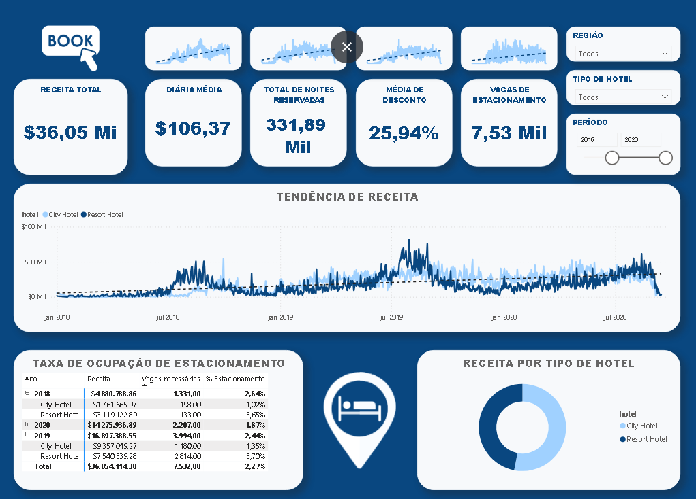

# 🏨 Hotel Booking Data Analysis

Análise de dados de reservas de hotéis (2018, 2019 e 2020) utilizando SQL Server e Power BI para responder a perguntas de negócio relevantes como crescimento de receita, tendência de ocupação e necessidade de infraestrutura.

---


## 📌 Descrição

Este projeto analisa dados reais de reservas de hotéis com o objetivo de responder questões de negócio importantes, como:

- A receita do hotel está crescendo?
- Qual tipo de hotel gera mais receita?
- Devemos expandir a infraestrutura?
- Quais são as tendências nas reservas ao longo dos anos?

Os dados foram extraídos, transformados e carregados no SQL Server e visualizados no Power BI.


---

## 🎯 Perguntas de Negócio
- A receita do hotel está crescendo ao longo dos anos?
- Devemos aumentar o número de vagas de estacionamento?
- Quais tendências podem ser observadas no comportamento dos clientes?

---

## 🗂️ Estrutura do Repositório

```text
hotel-booking-data-analysis/
├── data/              
├── docs/
│   └── business_questions.md
├── images/
├── powerbi/
├── sql/
│   ├── 01_eda_and_analysis.sql.sql
└── README.md
```
---

## 🛠️ Tecnologias Utilizadas
- SQL Server (SSMS)
- SQL (CTEs, JOINs, agregações)
- Power BI
- Excel / CSV
- Git & GitHub

---

## 🗄️ Modelagem e Preparação dos Dados
- Criação de banco de dados no SQL Server
- Importação de múltiplas tabelas (2018, 2019, 2020)
- Unificação dos dados via `UNION`
- Criação de métricas como **Revenue**
- Integração com tabelas auxiliares (`market_segment`, `meal_cost`)

---

## 📊 Análise Exploratória (EDA)
Principais análises realizadas:
- Evolução anual da receita
- Receita por tipo de hotel
- Relação entre vagas de estacionamento e noites reservadas
- Análise de ADR, descontos e número de noites

---

## 📈 Visualizações no Power BI
O dashboard interativo apresenta:
- Receita total
- ADR médio
- Total de noites reservadas
- Percentual médio de desconto
- Análise temporal por hotel

## 📊 Dashboard



Este dashboard apresenta visualizações da receita, ADR, noites reservadas e análise temporal por tipo de hotel.

---

## 🔍 Principais Insights
- A receita cresceu de 2018 para 2019, mas caiu em 2020
- O ADR aumentou em 2020, indicando tentativa de compensar queda de demanda
- Não há evidência de necessidade de ampliar vagas de estacionamento
- Descontos aumentaram como estratégia para atrair clientes

---
## 📌 Como Reproduzir

1. Clone o repositório:
   ```bash
   git clone https://github.com/sanss021/hotel-booking-data-analysis.git
2. Abra o banco no SQL Server.
3. Execute os scripts em sequência no SSMS.
4. Abra o arquivo PBIX no Power BI Desktop.

---

## 🚀 Próximos Passos
- Criar modelo preditivo de receita
- Analisar sazonalidade
- Migrar pipeline para Python
- Publicar dashboard no Power BI Service

---

## 👤 Autor
Samuel Silva  
Analista de Dados | SQL | Power BI | Python
